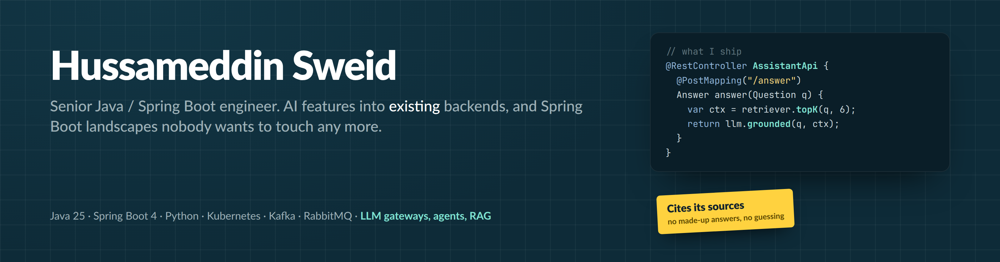
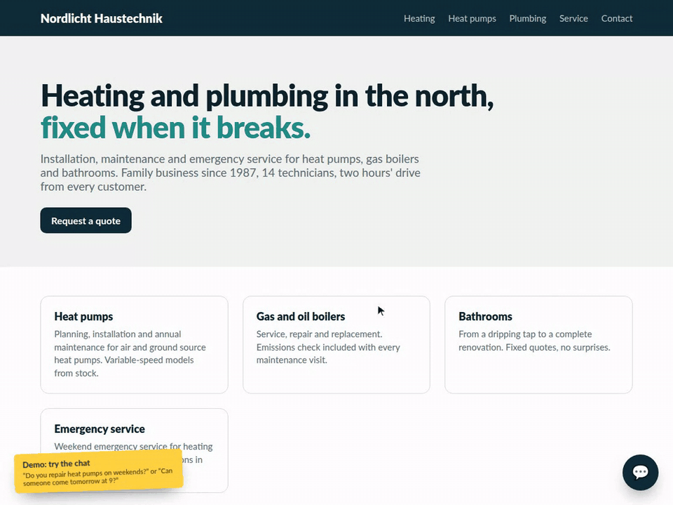
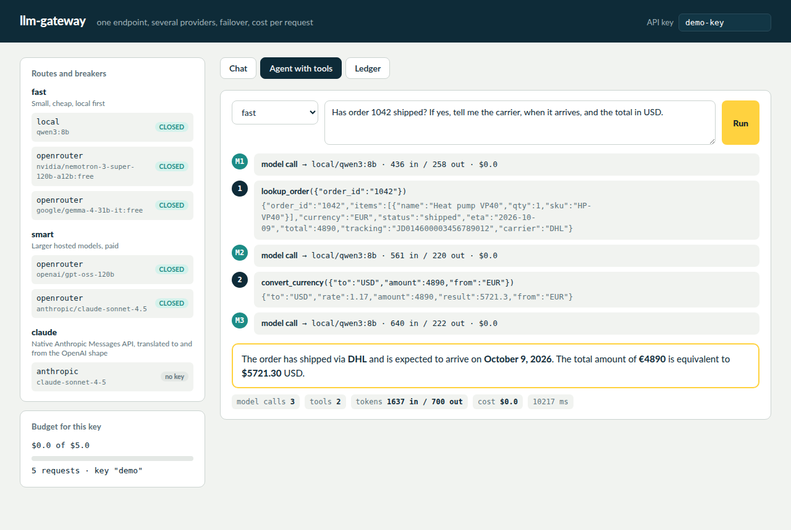

  

  
  
  

Seven years of Java and Spring Boot, microservices on Kubernetes, event-driven systems on RabbitMQ and Kafka, OAuth2 and OIDC. Today a senior engineer on an industrial IoT telemetry platform with 50+ developers. Before that I founded and led an AI agent platform: a multi-provider LLM gateway, agents with tool calling, MCP, a team of up to ten, two years in production.

 

## Building in public

<table>
<tr>
<td width="55%" valign="top">
  
</td>
<td valign="top">

### [support-bot](https://github.com/SweidHussameddin/support-bot)

A support chatbot that answers from your own documents, cites file and page, and hands the conversation to a person instead of guessing.

- FastAPI, one process, no vector database to operate
- Local hybrid retrieval: embeddings on CPU plus BM25, fused
- Any OpenAI-compatible model, free OpenRouter models for the demo
- Strict JSON answer contract; sources the model never saw are dropped
- Drop-in widget, one script tag, no framework
- Tests run without a key or network

 

</td>
</tr>
<tr>
<td width="55%" valign="top">
  
</td>
<td valign="top">

### [llm-gateway](https://github.com/SweidHussameddin/llm-gateway)

One OpenAI-compatible endpoint in front of several providers, with failover, cost control and tool-calling agent runs. The shape of the gateway I ran in production, reduced to what a team needs on day one.

- Spring Boot 4, Java 25, virtual threads, no database or broker
- Model aliases map to ordered routes; circuit breaker per route
- OpenAI-compatible providers plus a native Anthropic adapter, both streaming
- Tokens priced per route, JSONL ledger, per-key budgets (402 when spent)
- Agents run server-side tools that are plain Spring beans
- Checkstyle (Google style) and tests that need no network

  

</td>
</tr>
</table>

**Next up:** a Spring Boot 4 / Java 25 upgrade walkthrough on a real service, step by step with the tests green at every stop.

 

## What I do for clients

<table>
<tr><td width="24%"><b>AI into existing backends</b></td><td>LLM gateways, agents with tools, retrieval over your own data, evaluation sets, cost control. Java (Spring AI, LangChain4j) or Python (FastAPI).</td></tr>
<tr><td><b>Modernisation</b></td><td>Spring Boot 2 to 3 and 4, Java 8 to 25, Auth0 or Keycloak to Entra ID, monolith to events. Tests stay green at every step.</td></tr>
<tr><td><b>Quality and operations</b></td><td>Testcontainers, WireMock, quality gates, CI/CD, Kubernetes on Azure and bare metal.</td></tr>
<tr><td><b>Automation</b></td><td>n8n and AI agents for support and back-office work, built with error handling and runbooks.</td></tr>
</table>

 

## Stack

  
  
  
  
  
  
  
  
  
  

Most of my work lives in private repositories, by contract. The repos above are the part I can show.
